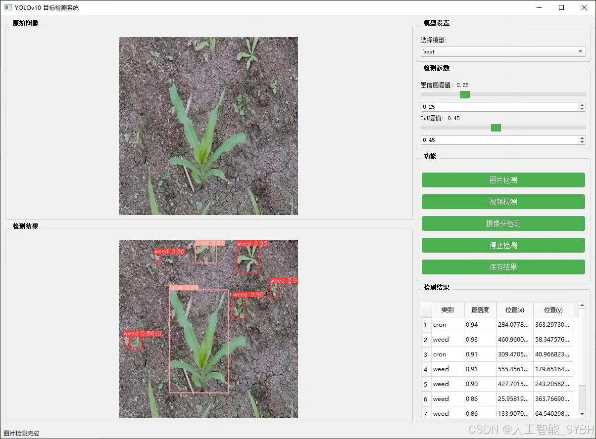
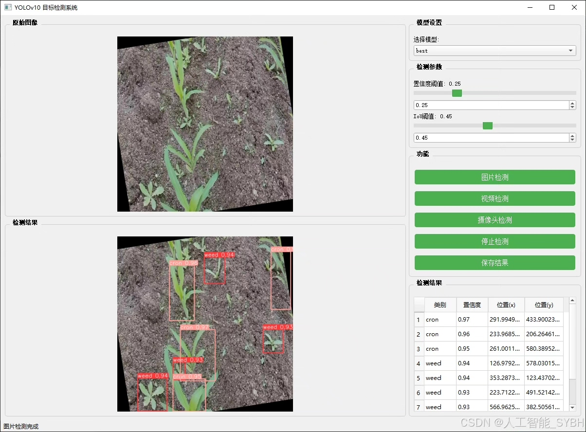
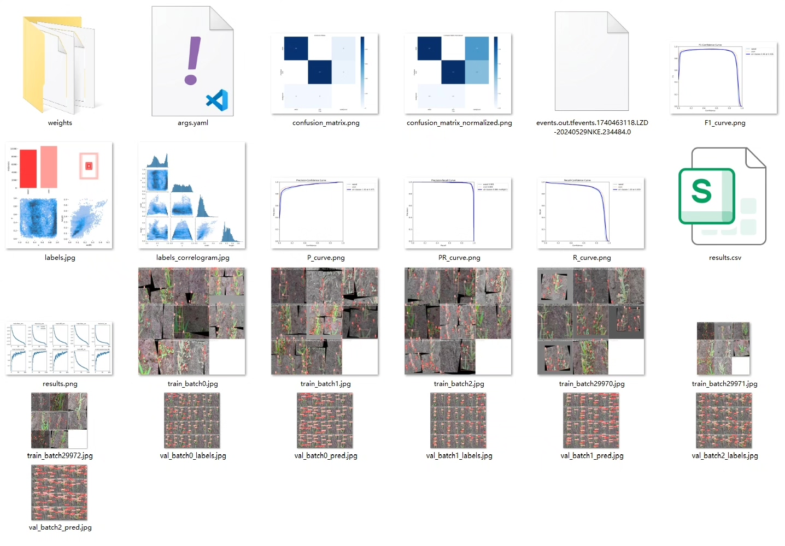
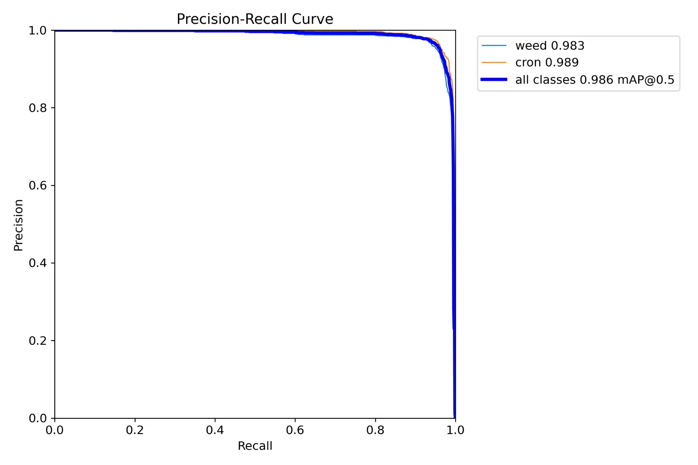
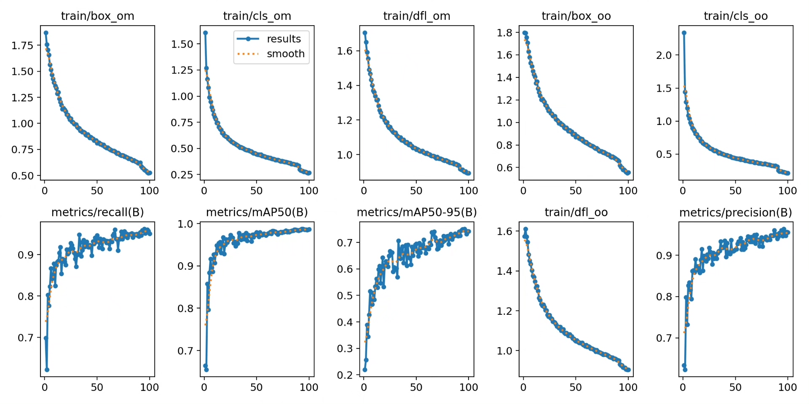
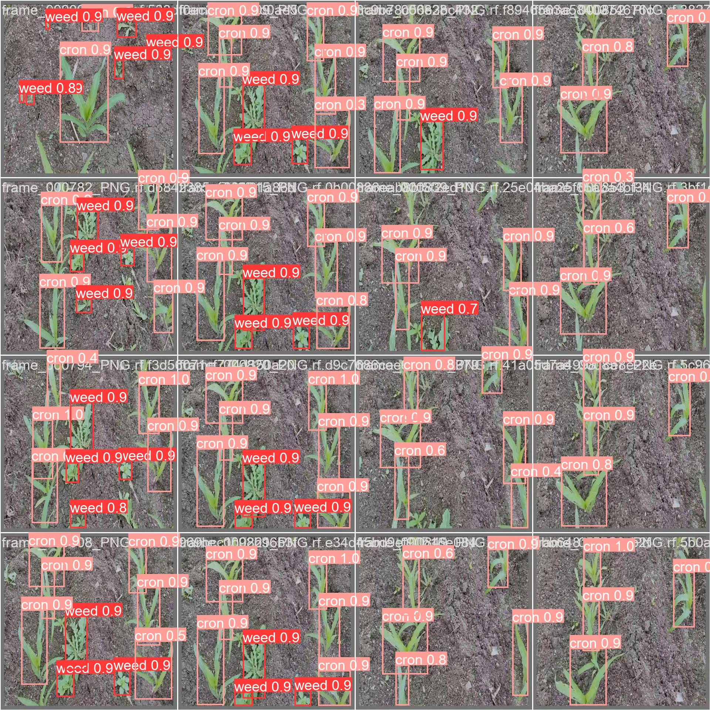
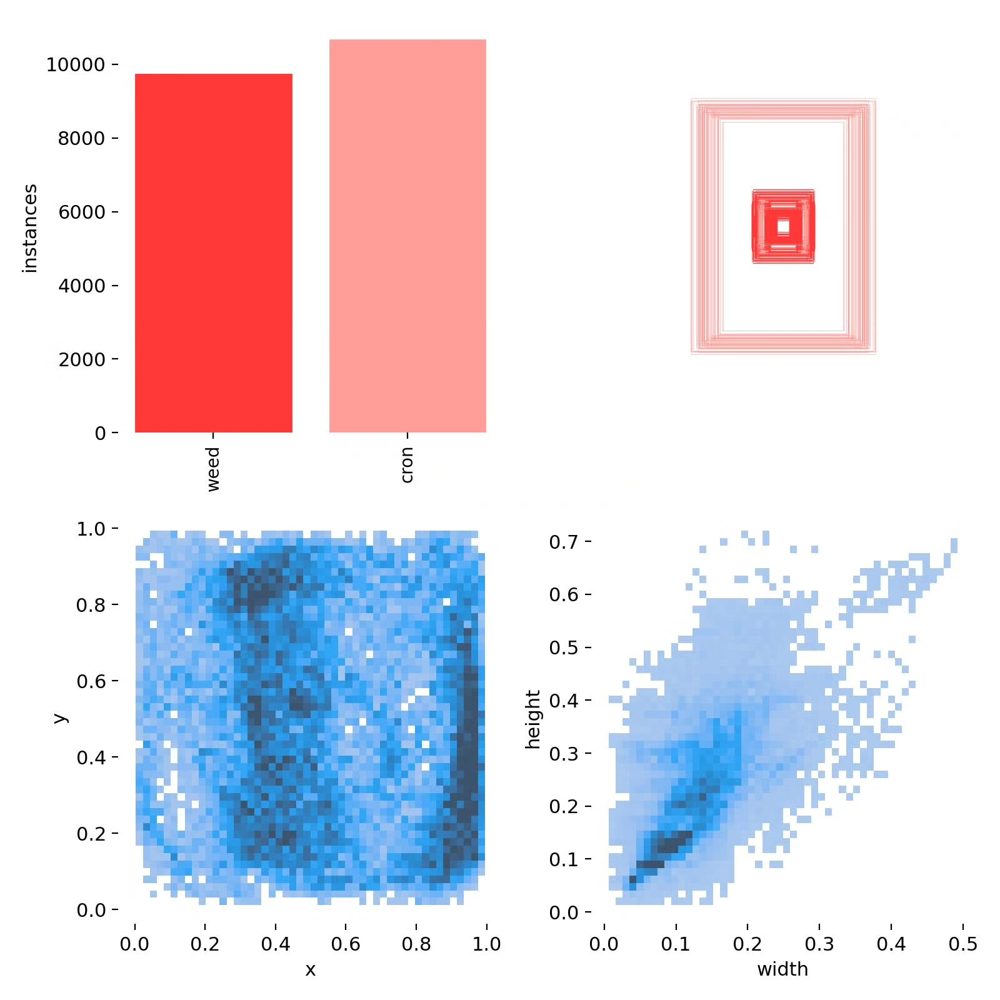
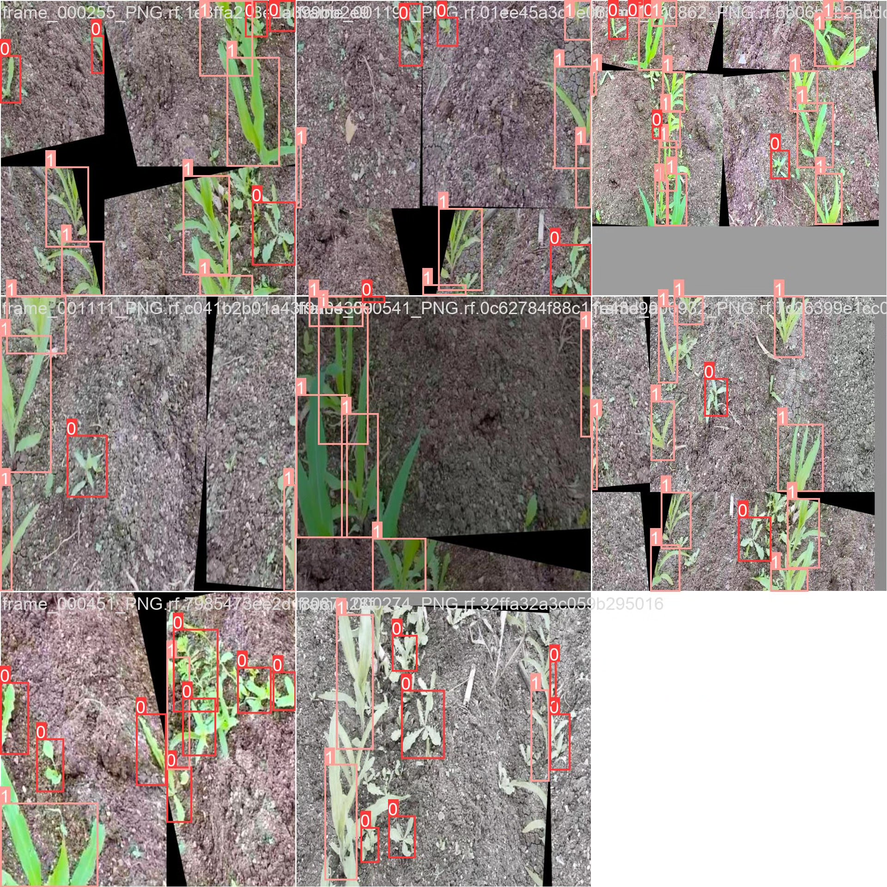

# Based on deep learning YOLOv10 for corn seedling weed detection system (YOLOv

## Body

Based on the deep learning YOLOv10, a corn seedling weed detection system (YOLOv10+YOLO dataset + UI interface + Python project source code + model)

Project background: In agricultural production, weeds are one of the important factors affecting crop growth. Weeds compete with crops for nutrients, water, and sunlight, leading to reduced crop yield. Traditional methods of weed identification and removal rely on manual operations, which are inefficient and costly. With the development of computer vision and deep learning technology, automated weed identification systems based on object detection have gradually become a research hotspot in the field of agriculture. The purpose of this project is to use the YOLOv10 model to build an efficient corn seedling weed detection system, helping farmers quickly identify weeds in the field and providing technical support for precision agriculture.

The company's products have obtained the official commercial license certification from YOLO.

We provide after-sales service.

After payment, we will provide a WeChat account for any questions, free of charge.

Environmental configuration: A tutorial on environmental configuration will be provided, and WeChat will provide answers to questions.

Remote installation service: If you need remote configuration, an additional fee of 69 is required,
if the configuration fails, all fees will be refunded (specially for old computers only refund installation fees).

Retraining dataset: After configuring the environment, you can train on your own computer.
If you need us to retrain, just pay 69 plus computing power fees (2.5 yuan/hour)

Full package of after-sales service

## Images

## Payment

Here is a pay link on Stripe ( https://buy.stripe.com/3cs8yP7sY87d0vu9AB ). Please contact me lonlonago@foxmail.com after funding $89, and I will send you a complete data files , thank you!

